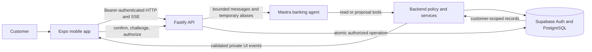
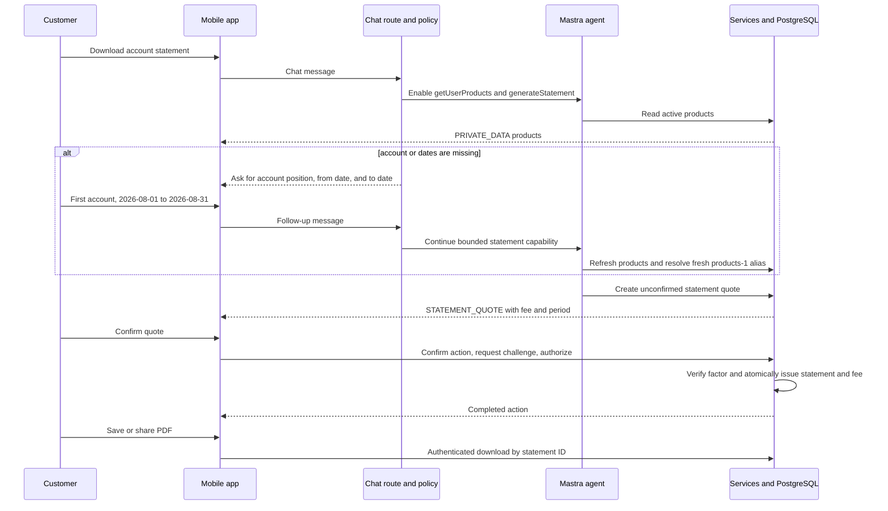

# Conversational Banking Simulator Architecture

This document describes the architecture implemented in the current working tree. The application is a security-focused simulator: it must use synthetic banking data and must not be connected to a real core-banking system.

## System shape

The repository is a pnpm TypeScript monorepo with three runtime boundaries:

- `apps/mobile`: Expo and React Native client. It renders conversation text and trusted banking controls, manages the local authenticated session, and invokes authenticated HTTP endpoints.
- `apps/backend`: Fastify API. It authenticates requests, constrains Mastra, persists chat history, validates server events, coordinates authorization, and exposes statement downloads.
- `supabase`: Supabase Auth and PostgreSQL. It is the source of truth for customers, banking records, chat history, pending actions, authorization settings, challenges, statement requests, knowledge publication, revocations, and audit records.

Shared wire and domain types live under `packages/`. Mastra is an orchestration dependency inside the backend, not an independent authority or state owner.

## Runtime ownership

| Concern | Owner | Notes |
| --- | --- | --- |
| Authentication and sessions | Supabase Auth plus the Fastify auth plugin | The backend derives the authentication-user ID, customer ID, session ID, and expiry from a verified token. |
| Conversation transport | Fastify `/api/chat` and mobile SSE client | Server UI events can stream as they are validated; model prose is buffered until the complete response passes output checks. |
| Intent capability | `sensitive-action-policy.ts` | Each turn receives an explicit tool allowlist. Unsupported money movement is rejected without invoking the model. |
| Language reasoning | Mastra `bankingAgent` | The agent may choose from the allowed tools and produce prose. It cannot authorize or execute banking mutations. |
| Private data display | Backend tools and typed `PRIVATE_DATA` events | Private records go to the authenticated client. The model receives request-scoped aliases instead of record identifiers or values. |
| Banking proposals | Backend tools and services | Card selection and statement quote tools create bounded pending records and emit typed UI events. |
| Confirmation and authorization | Mobile trusted controls plus Fastify action routes | Confirmation is separate from model prose. PIN, biometric signature, or TOTP authorization is verified by deterministic backend code. |
| Banking state changes | PostgreSQL functions and deterministic services | Ownership, state version, expiry, idempotency, challenge consumption, fee deduction, and audit behavior are enforced outside the model. |
| PDF delivery | Fastify statement route | Only an authenticated, customer-owned statement with `ISSUED` status can be downloaded. |

## Chat request path

1. The mobile client sends only the latest user message and session ID to `POST /api/chat`. Client-supplied history is rejected.
2. Fastify loads server-owned history, privacy-minimizes the new message, and applies the deterministic sensitive-action policy.
3. The policy chooses one capability set:
   - ordinary request: read-only banking and approved knowledge tools;
   - card block: card-block proposal tool only;
   - statement request: product display and statement-quote tools only;
   - money movement or mixed sensitive request: deterministic refusal with no model call.
4. Mastra receives bounded history, dynamic server date, authenticated request context, the selected tool allowlist, step/output limits, and input/output processors.
5. Tool events must pass the shared server-event schema and the per-turn capability policy before they are persisted or sent to the client.
6. Model text remains in a server-side buffer. Provider errors, aborts, tripwires, unfinished tool calls, excessive output, unapproved URLs, and unverified banking-outcome claims discard the buffer.
7. Safe text is policy-shaped, persisted, and sent as one SSE text event followed by `done`.

## Private data and aliases

Read tools query through the authenticated customer's database client. A private tool result has two outputs:

- a `PRIVATE_DATA` event containing customer-scoped records for the authenticated mobile UI;
- a minimal model-visible result containing ordinal aliases such as `products-1` or `accounts-2`.

Aliases live only in the current request context. A dependent tool must refresh the relevant list in the same turn and resolve the alias server-side. Database identifiers supplied directly by the model are not accepted as aliases.

## Statement request flow

Statement generation is a multi-request application flow, not a persisted Mastra workflow.

Required quote inputs are a freshly resolved account-backed product alias, `fromDate`, and `toDate`. The backend never chooses an account or period for the customer. If inputs are missing and no `STATEMENT_QUOTE` exists, the sensitive-action policy returns a trusted clarification instead of exposing arbitrary model text or reporting a false PDF failure. A plausible reply to that exact persisted prompt continues the statement capability; cancellation exits it.

`generateStatement` creates an unconfirmed quote and emits `STATEMENT_QUOTE`. It does not issue the statement or debit the fee. The trusted statement card performs confirmation, obtains a fresh authorization challenge using the configured method, and submits authorization. PostgreSQL then performs the once-only fee debit, transaction snapshot, statement issuance, and audit updates. The PDF endpoint accepts only the persisted statement ID and returns content only after issuance.

## Card-block flow

The card tool creates a pending action and emits `CARD_SELECTION`. The mobile card control supplies the selected customer-owned card, moves the action through confirmation, obtains a fresh authorization challenge, and submits authorization. The database-backed action service executes the block only from an authorized, current action version. Model prose cannot select, confirm, authorize, or claim completion.

## Authorization methods

Customers must configure one banking authorization method before using chat:

- `PIN`: a six-digit value stored as a salted password hash and subject to attempt limits and lockout;
- `BIOMETRIC`: the mobile device signs a short-lived server challenge with its enrolled Ed25519 key; a client boolean is not authorization;
- `TOTP`: Supabase verifies a bank-registered factor and a short-lived, action/session/version-bound challenge.

Changing the preference requires recent password verification and invalidates outstanding challenges through preference versioning. Authorization may rotate the authenticated session, so the mobile client applies returned tokens before continuing.

## Data and trust boundaries

- Customer-facing database reads use the verified user session and row-level security.
- Highly privileged service credentials remain backend-only and are used behind ownership checks and restricted RPCs.
- Public signup is disabled; customer provisioning is bank-managed.
- Knowledge ingestion stages documents with a dedicated principal. Only administrator-approved, effective versions can be retrieved.
- Model-generated JSON and URLs are inert. Only authenticated, schema-validated server UI events create controls, and only approved retrieved sources can contribute citation URLs.
- `AI_ENABLED` controls provider use. `BANKING_MUTATIONS_ENABLED` independently controls proposal and mutation endpoints.
- Local process rate limits are defensive only; a deployment needs a shared edge rate limiter and the external controls listed in the security operations guide.

## Persistence model

The main persisted concepts are:

- `customer_profiles`, `bank_accounts`, `cards`, `transactions`, and `customer_products` for simulator banking data;
- `chat_sessions` and `chat_messages` for server-owned conversation history and trusted UI-event records;
- `pending_actions`, authorization settings, approved factors, challenges, revocations, and audit events for execution control;
- `statement_requests` for quote, consent, issuance status, fee, and transaction snapshot;
- staged and published knowledge records plus search functions for approved product information.

Migrations under `supabase/migrations/` are the executable schema history. Documentation must not override their constraints or grants.

## Verification boundaries

The default suites cover type contracts, route behavior, policy classification, real Mastra trajectories with a mock model, tool schemas, private aliases, authorization services, mobile protocol parsing, dependency patches, and database security behavior where the explicitly isolated database suite is run.

Offline tests do not certify a live provider, hosted Supabase configuration, physical-device secure storage, production rate limits, backup recovery, or a real banking integration. Those remain release gates in `docs/security/OPERATIONS.md`.

## Canonical references

- `CONTEXT.md`: domain language.
- `docs/adr/0001-model-proposes-services-decide.md`: core authority decision.
- `docs/security/THREAT-MODEL.md`: attackers, assets, and trust boundaries.
- `docs/security/OPERATIONS.md`: deployment and incident controls.
- `docs/security/VERIFICATION.md`: dated verification evidence and its limitations.
- `README.md`: local setup and developer commands.
